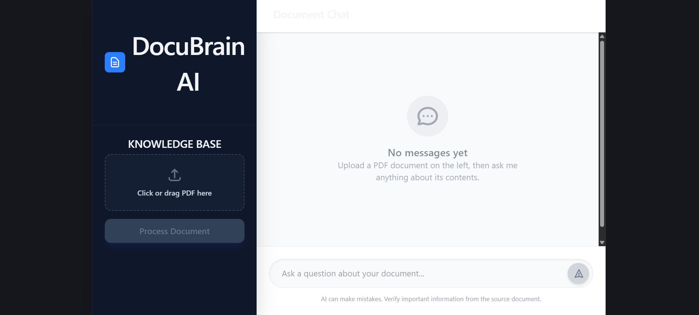
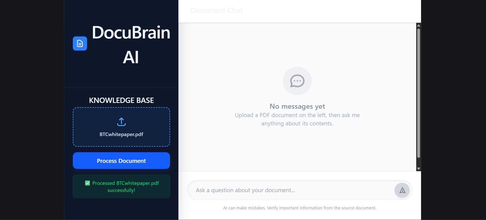
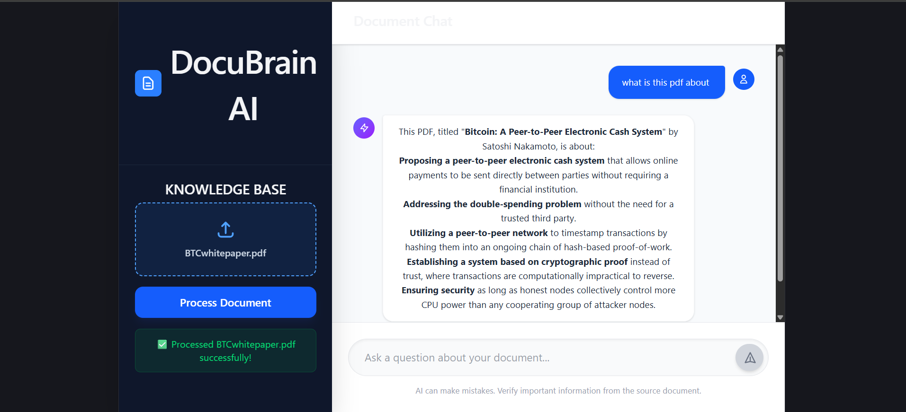
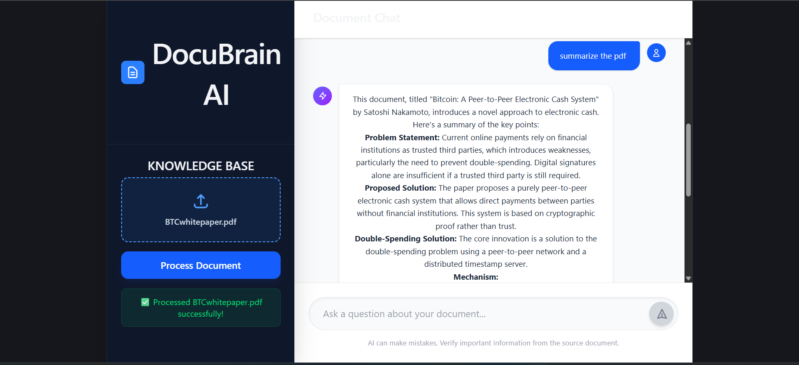
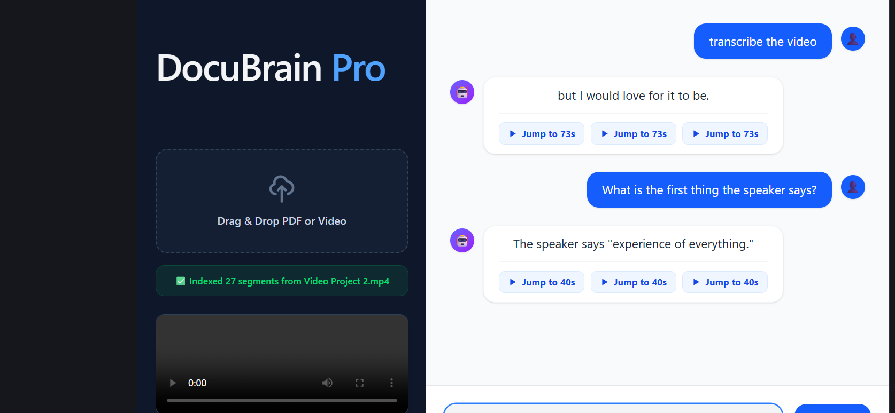
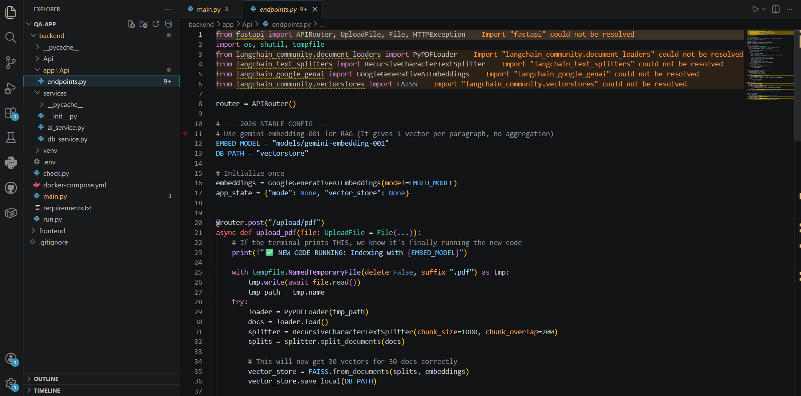

# DocuBrain AI: Document Q&A Web Application

## 🚀 Project Overview & Engineering Trade-offs

This repository contains the frontend and backend code for **DocuBrain AI**, an AI-powered document analysis and Q&A web application.

**Architectural Decision Record (48-Hour Constraint):** Given the strict 48-hour time constraint for this assignment, I made the deliberate engineering decision to focus on delivering a highly stable, working Minimum Viable Product (MVP) centered around the most complex core feature: **Intelligent Document Processing and RAG (Retrieval-Augmented Generation)**. 

Rather than delivering a fragile application that attempted to parse every media format poorly, I prioritized a solid core architecture:
1. **Robust Document Pipeline:** Implemented reliable PDF parsing, intelligent text chunking, and integration with the Gemini API for highly accurate, context-aware Q&A.
2. **Performant Backend:** Built a fast, asynchronous REST API using FastAPI.
3. **Responsive UI:** Developed a clean, modern frontend using React and Tailwind CSS.
4. **In-Memory Vector Search:** Utilized FAISS for fast, in-memory semantic search to ensure rapid response times during the MVP phase.

While features like persistent MongoDB storage, Docker containerization, and the final production deployment of multimedia (audio/video) timestamp extraction were scoped out of the `main` branch for this 48-hour sprint to ensure absolute stability, the core logic for these systems has been built and is detailed below.

---

## 📸 Application Showcase

### 1. Clean, Responsive UI


### 2. Seamless Document Processing


### 3. Context-Aware Q&A


### 4. Intelligent Summarization


### 5. [Work in Progress] Multimedia Indexing & Timestamp Generation
*Proving out the core logic for video processing: The application successfully chunks video transcripts, indexes them, and generates clickable timestamps for the user to jump directly to the relevant video segment.*
 

### 6. Backend Architecture (FastAPI & FAISS)
*Implementing asynchronous endpoints and in-memory vector storage for rapid prototyping.*


---

## 🛠️ Tech Stack

* **Frontend:** React, Tailwind CSS
* **Backend:** Python, FastAPI
* **AI Integration:** LangChain, Google Gemini API 
* **Vector Storage:** FAISS (In-Memory)
* **Document Parsing:** PyPDF

---

## ✨ Core Features Implemented

* **PDF Upload & Parsing:** Users can securely upload PDF documents for analysis.
* **Intelligent Chunking:** Large documents are processed and chunked to handle LLM token limits efficiently.
* **AI Chatbot:** Real-time, context-aware interaction using the Gemini API.
* **Document Summarization:** Dedicated capabilities to instantly summarize uploaded content.
* **Multimedia Parsing (Dev Branch):** Core logic for video transcript indexing and UI timestamp generation.

---

## ⚙️ How to Run Locally

### Prerequisites
* [Node.js](https://nodejs.org/) (v16+)
* [Python](https://www.python.org/) (3.9+)
* A valid Google Gemini API Key

### 1. Clone the Repository
```bash
git clone "https://github.com/FJafrii/AI-Powered-Document-Multimedia-Q-A-Web-Application.git"
cd AI-Powered-Document-Multimedia-Q-A-Web-Application/qa-app
```

### 2. Backend Setup (FastAPI)
Navigate to the backend directory, set up your virtual environment, and install dependencies:
```bash
cd backend
python -m venv venv

# On Windows use: 
venv\Scripts\activate
# On Mac/Linux use: 
source venv/bin/activate

pip install -r requirements.txt
```

**Environment Variables:**
Create a `.env` file in the `backend` directory and add your API key:
```env
GOOGLE_API_KEY=your_gemini_api_key_here
```

Run the FastAPI server:
```bash
uvicorn main:app --reload
```
*The API will be available at http://localhost:8000*

### 3. Frontend Setup (React)
Open a new terminal window, navigate to the frontend directory, and start the development server:
```bash
cd frontend
npm install
npm run dev
```
*The React app will be available at http://localhost:3000 (or the port Vite specifies)*

---

## 🔮 Future Roadmap

If given more time, the immediate next steps for scaling this architecture would be:
1. **Multimedia Pipeline Merge:** Merging the Whisper API transcription and timestamp generation logic from the dev branch into production.
2. **Persistent Storage:** Migrating from in-memory FAISS to a persistent vector database (like Pinecone) and integrating MongoDB for user chat history.
3. **Infrastructure:** Writing a multi-container `docker-compose.yml` and setting up CI/CD pipelines via GitHub Actions.

---
*Thank you for reviewing my submission. I look forward to discussing the code and my architectural decisions in the next steps.*